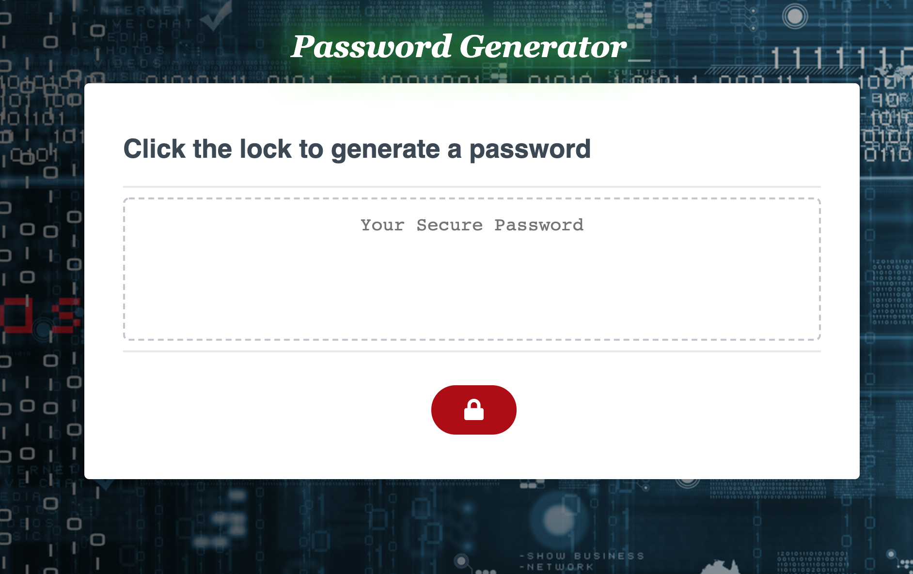
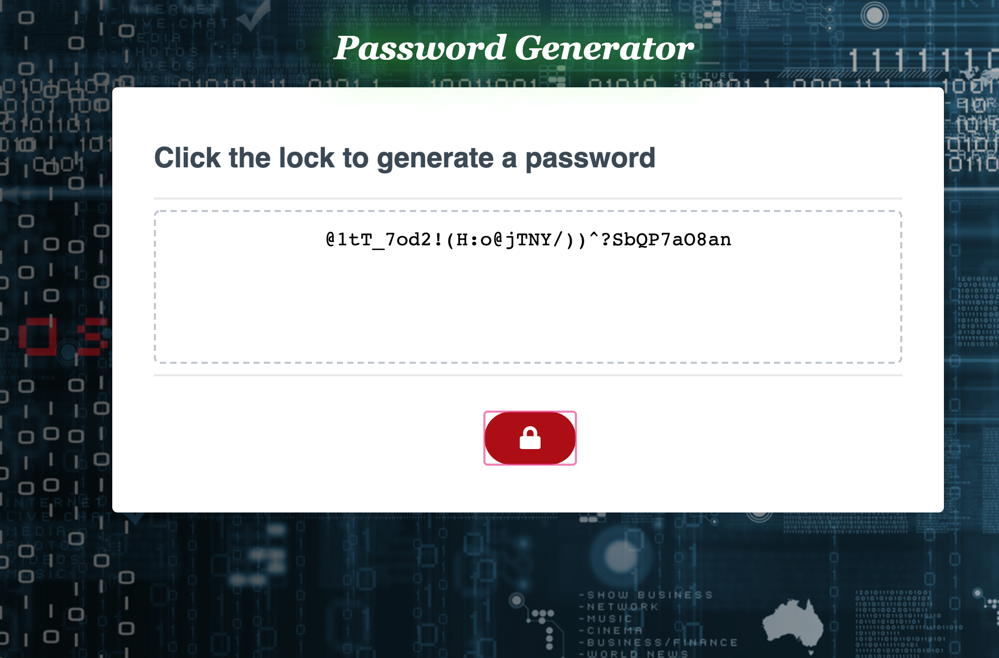
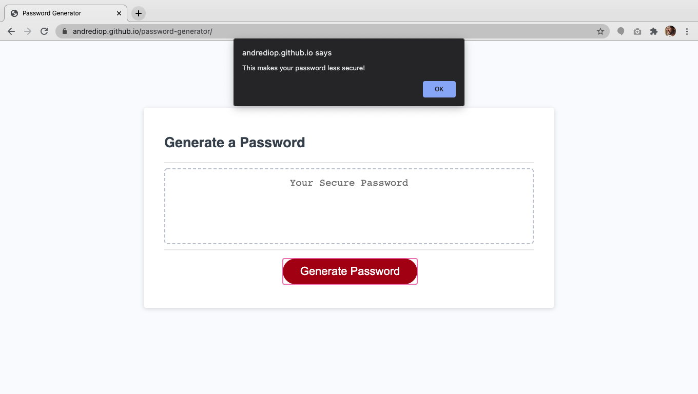

# Password Generator

## Table of Contents

[About](https://github.com/AndreDiop/Password-Generator/blob/main/README.md#About)

[Installation](https://github.com/AndreDiop/Password-Generator/blob/main/README.md#Access)

[Usage](https://github.com/AndreDiop/Password-Generator/blob/main/README.md#Usage)

[Screenshots](https://github.com/AndreDiop/Password-Generator/blob/main/README.md#Screenshots)

[Contributing](https://github.com/AndreDiop/Password-Generator/blob/main/README.md#Contributing)

[Licenses](https://github.com/AndreDiop/Password-Generator/blob/main/README.md#Licenses)

# About

Utilizing knowledge of Javascript, for loops, truth statements and methods, I was able to create a password generator that generates a password based on user specifications.

## Access

Users will access the page through either the direct link to the deployed application

```bash
https://andrediop.github.io/Password-Generator/
```

or through the Github repository

```bash
https://github.com/AndreDiop/Password-Generator
```

## Usage

This password generator should **NOT** be used for anything were security is needed. This is just to demonstrate the ability to manipulate user input using Javascript.

After clicking the generate password button, users are prompted for how many characters they need. 

Then the user is asked whether or not they require upper case characters, lowercase characters, numbers, and special characters. 

When users decline to modify their passwords, they are alerted that this makes their password less secure.

## Screenshots

These screen shots show the password prompts and the displayed password in the *password generator* field

```bash
Users are prompted to enter how many characters between 8 - 128 they need
```



```bash
Users are reminded to enter a value between 8- 128 when the value is not a number or not between the range of 8 - 128.
```


```bash
Users are presented with a password to use after clicking generate

```



```bash
Users are alerted when password is less secure after not adding modifications to password

```



## Contributing

This app couldn't have been built with out fellow students, instructors, tutors, and TA's of the GT coding bootcamp.

I'm not taking requests at this time however, please reach out to me if you see ways that I can improve upon my code.


## License

[MIT](https://choosealicense.com/licenses/mit/)
